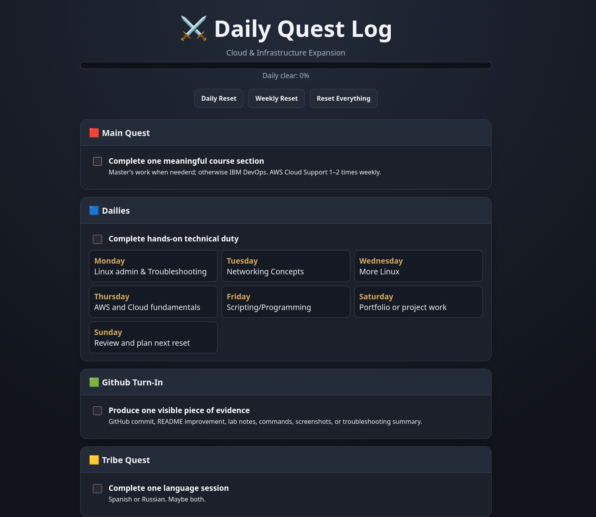

# Study Quest Log

A gamified daily and weekly study tracker inspired by MMORPG quest systems.

The project turns technical study goals into daily quests, levelling activities and weekly challenges. Progress is saved locally in the browser so completed tasks remain checked after refreshing the page.

## Live Demo

[Open the Study Quest Log](https://jordanflood.github.io/study-quest-log/)



## Features

- Interactive daily and weekly checklists
- Daily and weekly progress indicators
- Alternative low-energy completion route
- Persistent progress using browser localStorage
- Daily and weekly reset controls
- Responsive layout for desktop and mobile
- Hosted using GitHub Pages

## Technologies

- HTML5
- CSS3
- Vanilla JavaScript
- Browser localStorage
- Git and GitHub
- GitHub Pages

## Why I Built It

I just wanted to try and make something small and basic but also something I could use to organise my cloud, Linux, networking and DevOps studies without treating every study session as an all-or-nothing task.

I based the interface on MMORPG daily quest systems, where completing a small set of repeatable activities contributes toward longer-term progression.

## What I Practised

Through this project, I practised:

- Structuring a complete static web page
- Styling responsive layouts with CSS Grid
- Manipulating page elements with JavaScript
- Saving and retrieving browser data with localStorage
- Deploying a static project through GitHub Pages
- Maintaining and updating a project with Git

## Current Study Categories

- Linux administration
- Networking
- Bash and troubleshooting
- AWS fundamentals
- Technical support scenarios
- Portfolio development
- Spanish and Russian

## Running Locally

Clone the repository:

```bash
git clone https://github.com/jordanflood/study-quest-log.git
cd study-quest-log
